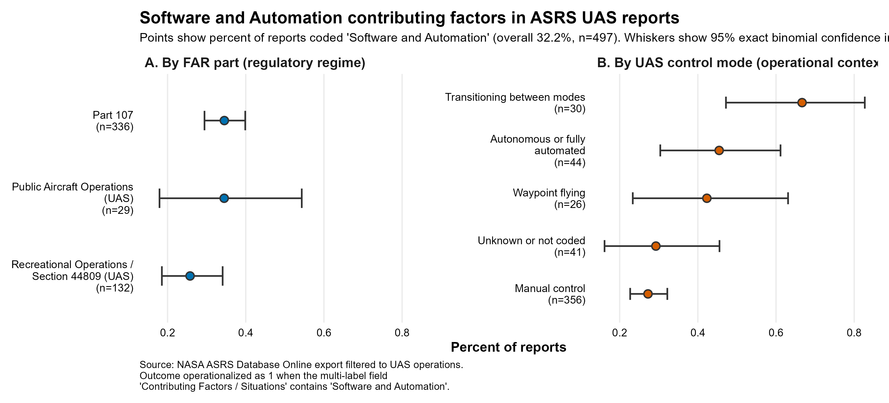

# asrs-uas-software-automation-analysis
Software and Automation Coding in UAS Reports: A Reproducible Analysis of NASA ASRS Incident Reports

HSE 531 Data Analytics Final Project, Human Systems Engineering, Arizona State University

## Overview

This repository contains the R script and output figure for a reproducible descriptive analysis of where software and automation contributing factors appear in uncrewed aircraft system (UAS) operations, using a public NASA Aviation Safety Reporting System (ASRS) export.

The analysis asks whether the proportion of reports coded with "Software and Automation" differs across regulatory regime (Part 107, Section 44809 recreational operations, and public aircraft operations) and across UAS control mode (manual, waypoint, autonomous, transitioning, and unknown or not coded), and how large those differences appear once uncertainty is represented.

## Figure

Points show subgroup percentages, horizontal whiskers show 95% exact binomial (Clopper-Pearson) confidence intervals, and subgroup sample sizes are labeled (n = 497).

## Repository Contents

- `Foster_HSE531-FinalProject-Script.R` — Full analysis script (CSV import, cleaning, recoding, confidence interval calculation, ggplot2 visualization, saved output)
- `Foster_HSE531-FinalProject-Figure.png` — Output figure produced by the script

## Data Source

The analysis uses a CSV export from the [NASA ASRS Database Online](https://asrs.arc.nasa.gov/search/database.html), filtered to three UAS-relevant FAR Part categories: Part 107, Recreational Operations / Section 44809 (UAS), and Public Aircraft Operations (UAS). The export contained 497 report records.

The CSV is not included in this repository because the ASRS export is generated per-session and is not a fixed, redistributable dataset. To reproduce the analysis, download a UAS-filtered CSV export from the ASRS Database Online using the filter settings documented in the script comments, then place the file in the same directory as the R script.

## How to Run

1. Install R and the required packages (`dplyr`, `ggplot2`, `scales`)
2. Place the ASRS CSV export in the same directory as the script
3. Set your working directory to that folder
4. Run the script top to bottom

The script will import the data, construct the binary outcome variable, compute subgroup summaries with exact binomial confidence intervals, generate the figure, and save it as a PNG.

## Key Analytic Decisions

- **Outcome variable:** Binary (1 if the multi-label "Contributing Factors / Situations" field contains "Software and Automation," 0 otherwise)
- **Unit of analysis:** One ASRS report, identified by accession/control number (ACN)
- **Uncertainty:** 95% exact binomial (Clopper-Pearson) confidence intervals for each subgroup
- **Scope:** Descriptive and exploratory. The analysis characterizes patterns within this ASRS export and does not support causal or population-incidence claims, because ASRS is a voluntary, confidential reporting system

## Context

This project was completed as the final project for HSE 531: Data Analytics at Arizona State University. It is included as a portfolio accomplishment in the MS Human Systems Engineering culminating experience portfolio.

## License

This analysis script is provided for educational and reproducibility purposes. The NASA ASRS data is a public resource maintained by NASA.
